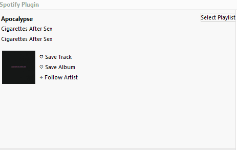
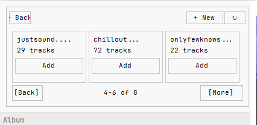
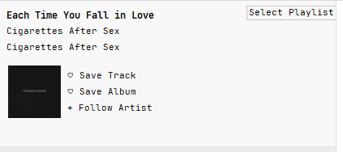
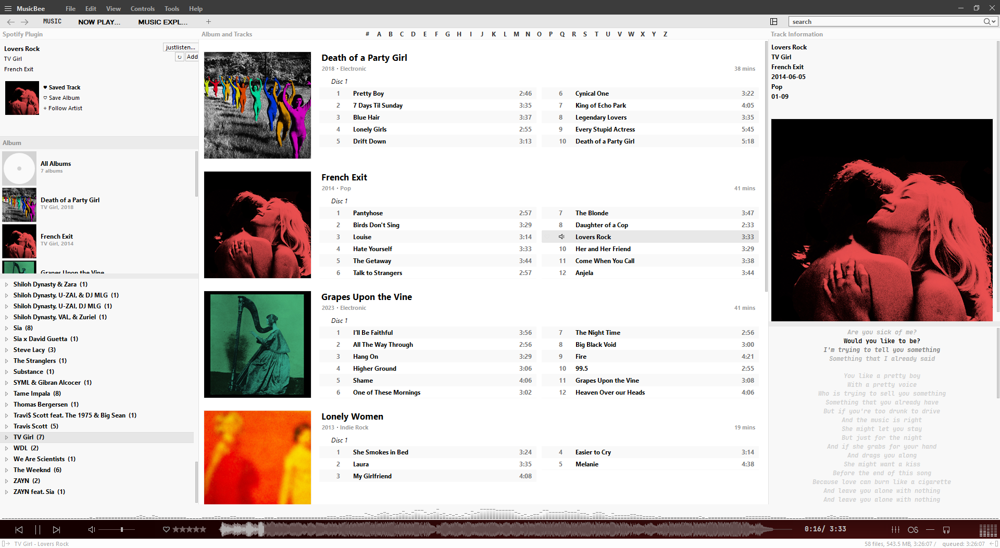

# mb_Spotify Plugin

A Spotify integration plugin for [MusicBee](https://www.getmusicbee.com/).

[⬇️ Skip to Installation & Setup](#installation--setup)

The plugin allows you to interact with your Spotify library directly from MusicBee, including searching for tracks, viewing Spotify track information and artwork, checking library status, and managing playlists with real-time caching.

> **Project status:** Actively maintained and under continued development.

---

## See it in action

<b>View animated demos & live sync (Click to expand)</b>

 

.gif)

---

## Screenshots

---

## Video Guide

[Watch Video Tutorial / Setup Guide](https://drive.google.com/file/d/1jwjIQVGokWHqqYz3GwY_MzYJUorF7qDY/view?usp=drive_link)

---

## Installation & Setup

### 1. Install and Initialize the Plugin
1. Build the plugin or obtain the latest release files for `mb_Spotify`.
2. Copy the plugin files into MusicBee's Plugins directory.
   - *Example Windows path:* `C:\Users\<you>\AppData\Roaming\MusicBee\Plugins`
3. Open MusicBee and verify that the plugin appears in `Edit > Preferences > Plugins`.
4. Restart MusicBee.
5. Select or open the mb_Spotify plugin to start its setup process.
6. When the plugin prompts you for a **Client ID**, keep the prompt open and continue with the next section.

### 2. Create and Configure a Spotify Developer App
Because of Spotify's Developer Mode restrictions, each user must have a premium account and configure their own application.

1. Sign in to the [Spotify Developer Dashboard](https://developer.spotify.com/dashboard/).
2. Click **Create an App**. Give it a name (for example, `MusicBee Plugin`) and a brief description.
3. Add `http://127.0.0.1:5000/callback` as the redirect URI.
4. Save the app settings and copy its **Client ID**.
5. Return to MusicBee and paste the **Client ID** into the mb_Spotify setup prompt.
6. Complete the Spotify authorization flow when prompted.

> 🔴 **Security Warning:** The plugin only requires your **Client ID**. Never share your Spotify password or Client Secret with anyone.

---

## Features

### Spotify Integration & Library Management
- **Authentication:** Secure OAuth 2.0 flow using PKCE with persistent tokens, automatic background renewal, and a refreshed login UI.
- **Playlist Panel & Caching:** Dedicated slider panel to browse your Spotify playlists, view live track counts, and manage playlist items with instant dynamic UI updates.
- **Track & Library Sync:** Real-time checking and management for saved tracks, saved albums, and followed artist status directly from the MusicBee interface.
- **Track Search:** Searches Spotify for current playing or selected tracks in MusicBee, fetching high-resolution artwork and track metadata.

### Technical Highlights
- **Single-DLL Deployment:** Packaged using Costura.Fody to embed dependencies (e.g., Newtonsoft.Json, EmbedIO) into a single, clean `.dll` file for simple installation.
- **Cache Concurrency & Synchronization:** Thread-safe playlist caching with in-memory membership tracking, file-level locking, cache invalidation, and SemaphoreSlim-based refresh coordination to prevent duplicate API requests.
- **Startup & Failure Protection:** Extended null checks and protective bounds handling during slow MusicBee initialization to prevent `NullReferenceException` and UI crashes.
- **Search-Generation Control:** Prevents delayed asynchronous background searches from overwriting the UI when quickly skipping through tracks.
- **Diagnostic Logging:** Dedicated trace logging for API requests, cache operations, and authentication state to simplify troubleshooting.

---

## Development

The project is written in **C#** and uses the Spotify Web API for integration.

### Branches
- **`main`**: The current stable branch. Contains the latest fully tested working version.
- **`dev`**: The active development branch. New fixes, experiments, and future improvements are staged here.
- **`playlist-dev`**: Feature branch for playlist caching, concurrency synchronization, and slider panel UI updates.
- **`working-baseline`**: A preserved checkpoint representing an earlier known-good state of the plugin.

*(Note: The tag `spotify-stable-pre-framework` identifies the fully working state reached before future framework modernization.)*

---

## Project History

- **Original Author:** Zachary Cohen (`zkhcohen`)
- **Current Maintainer:** Aditya Sharma (Resumed August 2026)

This project is licensed under the [MIT License](LICENCE). The original author's architecture, historical releases, and attribution are strictly preserved in the project history. Permission to continue development and distribute the project under the MIT License was granted by the original author.