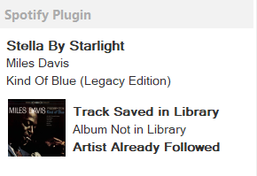

# mb_Spotify-Plugin

A Spotify integration plugin for [MusicBee](https://www.getmusicbee.com/).

The plugin allows you to interact with your Spotify library directly from MusicBee, including searching for tracks, viewing Spotify track information and artwork, checking library status, and interacting with Spotify authentication.

> **Project status:** Actively maintained and under continued development.

## Screenshots



Additional screenshots can be placed in the repository directory [showcase](showcase/). For example, future PNG files can be added there and referenced from this README.

---

## About

`mb_Spotify-Plugin` was originally created by **Zachary Cohen (`zkhcohen`)** and developed through the 3.x releases before the original repository was archived in November 2022.

Development resumed in August 2026 with the goal of maintaining and improving the plugin while preserving the original project's history and attribution.

The current development focuses on restoring reliability, improving asynchronous behavior, strengthening Spotify authentication, improving error handling, and eventually modernizing the underlying project.

---

## Current Features

* Spotify authentication using PKCE.
* Persistent Spotify authentication tokens.
* Automatic token renewal.
* Spotify track searching.
* Track information retrieval.
* Spotify artwork retrieval.
* Track library-status checking.
* Album library-status checking.
* Followed-artist checking.
* MusicBee panel updates after authentication and track changes.
* Improved handling of asynchronous track searches.
* Protection against stale search results.
* Thread-safe token refresh handling.
* Diagnostic API request/response logging.
* Improved error handling and UI recovery.

---

## Authentication

The plugin uses Spotify's OAuth/PKCE authentication flow.

Authentication state is persisted so the plugin does not need to request authorization every time MusicBee starts.

The authentication system also handles token renewal and prevents multiple refresh operations from occurring simultaneously.

### Authentication reliability

During the 2026 maintenance work, several concurrency problems were identified and corrected.

Multiple Spotify API requests can occur almost simultaneously when MusicBee changes tracks. Previously, several requests could detect an expired token at the same time and attempt to refresh it concurrently.

This could result in Spotify returning:

```text
invalid_grant
```

Token refresh is now synchronized so that only one refresh operation can occur at a time.

---

## Track Search

Track searching has also received significant reliability improvements.

MusicBee can generate multiple track-change notifications close together. Because Spotify requests are asynchronous, older searches can otherwise finish after a newer search and overwrite the current panel state.

The current implementation uses search-generation control to prevent stale search results from updating the UI.

Search state and library-status checks are also handled independently so that a failure while checking library information does not incorrectly turn an otherwise successful Spotify search into:

```text
No Track Found!
```

---

## Diagnostic Logging

The plugin includes diagnostic logging for Spotify API operations.

The logs record actual HTTP requests and responses, making it possible to distinguish between:

* Authentication failures
* Token-refresh failures
* Spotify API errors
* Concurrent requests
* Search failures
* Library-check failures
* UI/state-management problems

This logging was particularly useful during the 2026 restoration and debugging work.

---

## Installation

### Requirements

* [MusicBee](https://www.getmusicbee.com/)
* A Spotify account
* A Spotify application configured for the plugin's authentication flow

### Installing the plugin

Build or obtain the plugin files and place the required contents of the `Plugins` directory into your MusicBee Plugins directory.

Restart MusicBee after installation.

---

## Development

The project is written in **C#** and uses the Spotify Web API through the included Spotify API components.

The main components include:

```text
spot_mb/
├── MusicBeeInterface.cs
├── PanelInterface.cs
├── SpotifyIntegration.cs
├── mb_Spotify-Plugin.cs
│
├── Authenticators/
│   ├── AuthorizationCodeAuthenticator.cs
│   └── PKCEAuthenticator.cs
│
└── SpotifyAPI.Web/
    └── Http/
        └── APIConnector.cs
```

The project also contains supporting models, Spotify API utilities, authentication components, and MusicBee integration code.

---

## Development Branches

The repository currently uses separate branches for stable and active development.

### `main`

The current stable branch.

It contains the latest fully tested working version.

### `dev`

The active development branch.

New fixes, experiments, and future improvements should be developed here before being merged into `main`.

### `working-baseline`

A preserved checkpoint representing the earlier known-good state of the plugin before the later authentication, concurrency, and UI fixes.

---

## Stable Checkpoint

The repository contains a tagged stable checkpoint:

```text
spotify-stable-pre-framework
```

This tag identifies the fully working state reached before future framework modernization.

It is intentionally preserved as a recovery point while further development continues.

---

## Project History

### Original Development

The plugin was originally developed by **Zachary Cohen (`zkhcohen`)**.

The original project progressed through several releases:

### Release 2.0

* Improved performance.
* Removed the previous 500-album restriction.
* Added automatic re-authentication prompts after the computer resumed from sleep.

### Release 2.0.2

* Fixed error-log spam.

### Release 3.0.5

* Upgraded Spotify API methods to the 6.x.x specification.
* Implemented PKCE authentication.
* Added token persistence.
* Added automatic token renewal.
* Added general speed improvements.

### Beta 3.1

* Fixed issues related to network disconnections.
* Improved refreshing behavior.
* Included various additional bug fixes.

The original repository was archived by its owner in November 2022.

---

## 2026 Development

Active development resumed in August 2026.

The initial restoration focused heavily on understanding the existing architecture and stabilizing the plugin before making larger structural changes.

Major work included:

* Restoring reliable Spotify authentication.
* Fixing authentication UI freezes.
* Improving authentication error handling.
* Adding API diagnostics.
* Fixing empty search terms.
* Improving track-search handling.
* Adding Spotify library-status checks.
* Fixing concurrent token-refresh operations.
* Adding semaphore-based synchronization.
* Preventing overlapping searches from producing stale UI data.
* Improving panel refresh behavior.
* Separating successful Spotify searches from library-check failures.
* Improving asynchronous error handling.
* Preserving the original project attribution and history.

See [`CHANGELOG`](CHANGELOG.txt) for the detailed development history.

---

## Known Issues

The project is actively maintained and may still contain areas requiring further testing.

Spotify API behavior, authentication requirements, MusicBee notifications, and asynchronous request timing can all affect plugin behavior.

Additional testing is especially important when modifying:

* Authentication
* Token renewal
* Spotify API requests
* Track-change handling
* Library modifications
* MusicBee UI updates

---

## Roadmap

Future development may include:

* Further Spotify API compatibility improvements.
* Improved library modification support.
* More robust asynchronous request management.
* Additional error recovery.
* Improved logging and diagnostics.
* Project/framework modernization.
* Additional MusicBee integration improvements.
* Continued testing against current Spotify API behavior.

Framework modernization will be performed separately from the current stable implementation so that the existing working state remains recoverable.

---

## Credits

### Original Author

**Zachary Cohen (`zkhcohen`)**

The original `mb_Spotify-Plugin` project, architecture, and historical releases were created by Zachary Cohen.

### Current Maintainer

**Aditya Mahi**

Active maintenance and development resumed in August 2026.

The current development builds upon the original project while preserving the original author's work and attribution.

---

## License

This project is licensed under the [MIT License](LICENSE).

The original project was created by **Zachary Cohen (`zkhcohen`)**.  
Development and maintenance resumed in 2026 under **Aditya Mahi**.
The original author's work and attribution are preserved in the project history.
Permission to continue development and distribute the project under the MIT License was granted by the original author.

Refer to the repository's license files and original project documentation for licensing information.

**Original project:** Zachary Cohen / `zkhcohen`
**Current maintainer:** Aditya Mahi
From August 8, 2026
**Project:** `mb_Spotify-Plugin`

